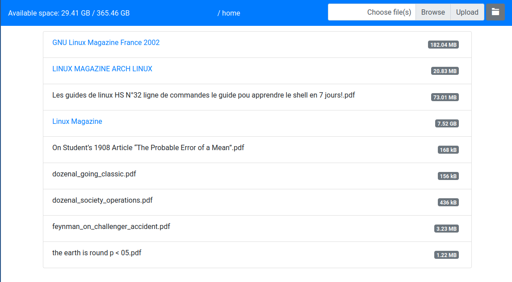

# Haskell Web File Manager

A toy project to experiment with the Spock Haskell framework

This proof of concept of a remote file manager allows to store files on a network, and, explore the file system, download or upload files, and monitor the remote system.

Nothing is foolproofed and this project was mostly useful to gain experience with this haskell library.

